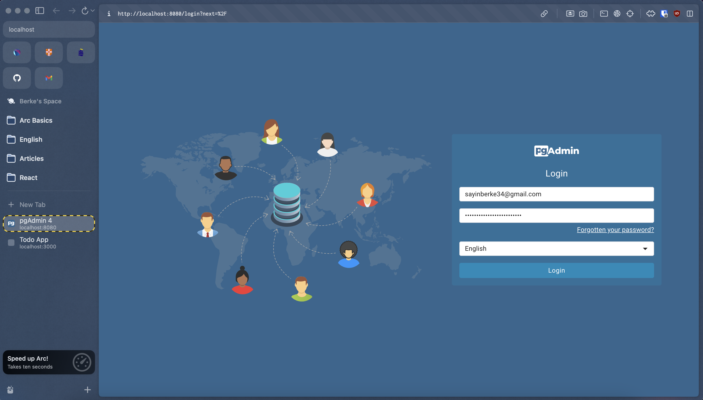

## Using Containers

Developing, testing and deploying application with containers.

### Table Of Contents

[**1.About The Application**](#about) <br />
[**2.Create Docker Assets**](#docker-assets) <br />
[**3.Run The Application**](#run-app) <br />
[**4.Add A Local DB And Persist Data**](#local-db) <br />
[**5.Run The App Again**](#run-app-again) <br />
[**6.Run PG Admin As A Container With Same Network**](#run-pg-admin) <br />
[**6.Configure And Run A Development Container**](#dev-container) <br />
[**7.Run Development Container And Debug Application**](#run-dev-container) <br />

### About The Application <a name="about"></a>

Developing, testing and deploying application with containers.

### Create Docker Assets <a name="docker-assets"></a>

```sh
docker init 
```

#### Directory Tree 

```
├── docker-nodejs-sample/
│ ├── spec/
│ ├── src/
│ ├── .dockerignore
│ ├── .gitignore
│ ├── compose.yaml
│ ├── Dockerfile
│ ├── package-lock.json
│ ├── package.json
│ ├── README.Docker.md
│ └── README.md
```

### Run The Application <a name="run-app"></a>

`compose.yaml` file. 

```yaml
services:
  server:
    build:
      context: .
    environment:
      NODE_ENV: production
    ports:
      - 3000:3000
```

```Dockerfile
# syntax=docker/dockerfile:1

# Comments are provided throughout this file to help you get started.
# If you need more help, visit the Dockerfile reference guide at
# https://docs.docker.com/go/dockerfile-reference/

# Want to help us make this template better? Share your feedback here: https://forms.gle/ybq9Krt8jtBL3iCk7

ARG NODE_VERSION=20.12.1

FROM node:${NODE_VERSION}-alpine

# Use production node environment by default.
ENV NODE_ENV production

WORKDIR /usr/src/app

# Download dependencies as a separate step to take advantage of Docker's caching.
# Leverage a cache mount to /root/.npm to speed up subsequent builds.
# Leverage a bind mounts to package.json and package-lock.json to avoid having to copy them into
# into this layer.
RUN --mount=type=bind,source=package.json,target=package.json \
    --mount=type=bind,source=package-lock.json,target=package-lock.json \
    --mount=type=cache,target=/root/.npm \
    npm ci --omit=dev

# Run the application as a non-root user.
USER node

# Copy the rest of the source files into the image.
COPY . .

# Expose the port that the application listens on.
EXPOSE 3000

# Run the application.
CMD node src/index.js
```

Run this command inside the `developing-with-containers` directory. 

```sh
docker compose up --build
```
#### Image Created 

```sh
docker images
```

```sh
REPOSITORY                               TAG           IMAGE ID        CREATED           SIZE
developing-with-containers-server        latest        a987af256514    52 seconds ago    153MB
```

#### Container Running 

```sh
docker ps
```

```sh
CONTAINER ID   IMAGE                               COMMAND                  CREATED         STATUS         PORTS                    NAMES
937461c2d7b7   developing-with-containers-server   "docker-entrypoint.s…"   3 minutes ago   Up 3 minutes   0.0.0.0:3000->3000/tcp   developing-with-containers-server-1
```

Go to http://localhost:3000/ and add new todo item. 

#### Stop The Application

```sh
docker compose down
```

or `ctrl + c` and 

```sh
docker compose rm
```

### Add A Local DB And Persist Data <a name="local-db"></a>

Containers can be used to set up local services, like a database. Update the `compose.yaml` file for `postgre` db container. 

#### Update `compose.yaml` file

```yaml
services:
  server:
    build:
      context: .
    container_name: todo-server-c
    ports:
      - 3000:3000
    environment:
      NODE_ENV: production
      POSTGRES_HOST: db
      POSTGRES_USER: postgres
      POSTGRES_PASSWORD_FILE: /run/secrets/db-password
      POSTGRES_DB: example
    depends_on:
      db:
        condition: service_healthy
    secrets:
      - db-password
    networks:
      - todo-network
  db:
    image: postgres
    container_name: postgres-db-c
    restart: always
    user: postgres
    secrets:
      - db-password
    volumes:
      - db-data:/var/lib/postgresql/data
    environment:
      - POSTGRES_DB=example
      - POSTGRES_PASSWORD_FILE=/run/secrets/db-password
      - POSTGRES_HOST_AUTH_METHOD=md5 #added 
      - PGDATA=/var/lib/postgresql/data/pgdata #added 
    expose:
      - 5432
    ports:
      - "5432:5432"
    healthcheck:
      test: [ "CMD", "pg_isready" ]
      interval: 10s
      timeout: 5s
      retries: 5
    networks:
      - todo-network
volumes:
  db-data:
secrets:
  db-password:
    file: db/password.txt
networks:
  todo-network:
    driver: bridge
```

#### Create db/password.txt

In the root directory, create a new directory named `db`. Inside it, create a file named `password.txt`. Add a password there. The password must be on a single line.

`db/password.txt` : Resample-Landlady5-Bottle

### Run The App Again <a name="run-app-again"></a>

```sh
docker compose up --build 
```

#### Images

```sh
docker images
```

```sh
REPOSITORY                             TAG           IMAGE ID       CREATED         SIZE
developing-with-containers-server      latest        b84a095f6745   18 hours ago    153MB
postgres                               latest        d4ffc32b30ba   2 months ago    453MB
```
 
#### Containers Running

```sh
docker ps
```

```sh
CONTAINER ID   IMAGE                               COMMAND                  CREATED         STATUS                   PORTS                    NAMES
05e6b9a6e1c1   developing-with-containers-server   "docker-entrypoint.s…"   2 minutes ago   Up 2 minutes             0.0.0.0:3000->3000/tcp   todo-server-c
cd7628aaaeee   postgres                            "docker-entrypoint.s…"   2 minutes ago   Up 2 minutes (healthy)   0.0.0.0:5432->5432/tcp   postgres-db-c
```


### Run PG Admin As A Container With Same Network <a name="run-pg-admin"></a>

We may need to check `database` and `tables` with `datas` created for the application. For this, we will use `pgadmin` as a container. It will be using the same `network` with the `application (todo-server-c)` and `postgres (postgres-db-c)` containers.  

#### Check Network Created

The `network` is created with the compose configuration after running `docker compose up --build command`. To see the `docker network` for our application use this command: 

```sh
docker network ls
```

```sh
NETWORK ID     NAME                                      DRIVER    SCOPE
42a5d9a6172c   developing-with-containers_todo-network   bridge    local
```

#### Check Network Used By Containers

**Container Name**: `todo-server-c` & **Container ID**: `05e6b9a6e1c1`

```sh
docker inspect 05e6b9a6e1c1 -f "{{json .NetworkSettings.Networks }}"
```

```json
{
  "developing-with-containers_todo-network": {
    "IPAMConfig": null,
    "Links": null,
    "Aliases": [
      "todo-server-c",
      "server"
    ],
    "MacAddress": "02:42:c0:a8:00:03",
    "NetworkID": "42a5d9a6172c8e092d1aff994931297d5b6b6b8ad39418fb2fd2b5f3804af21b",
    "EndpointID": "fd90f32c7f0f37bc81a8ab8c9b8f36aea1fbdfb6b993a5dd1784a74bdfeaf310",
    "Gateway": "192.168.0.1",
    "IPAddress": "192.168.0.3",
    "IPPrefixLen": 20,
    "IPv6Gateway": "",
    "GlobalIPv6Address": "",
    "GlobalIPv6PrefixLen": 0,
    "DriverOpts": null,
    "DNSNames": [
      "todo-server-c",
      "server",
      "05e6b9a6e1c1"
    ]
  }
}
```

**Container Name**: `postgres-db-c` & **Container ID**: `cd7628aaaeee`

```sh
docker inspect cd7628aaaeee -f "{{json .NetworkSettings.Networks }}"
```

```json
{
  "developing-with-containers_todo-network": {
    "IPAMConfig": null,
    "Links": null,
    "Aliases": [
      "postgres-db-c",
      "db"
    ],
    "MacAddress": "02:42:c0:a8:00:02",
    "NetworkID": "42a5d9a6172c8e092d1aff994931297d5b6b6b8ad39418fb2fd2b5f3804af21b",
    "EndpointID": "ea4bb939b72e09813e6ee1d6e252b53bba68d59b4aed72e3429c77810db06e42",
    "Gateway": "192.168.0.1",
    "IPAddress": "192.168.0.2",
    "IPPrefixLen": 20,
    "IPv6Gateway": "",
    "GlobalIPv6Address": "",
    "GlobalIPv6PrefixLen": 0,
    "DriverOpts": null,
    "DNSNames": [
      "postgres-db-c",
      "db",
      "cd7628aaaeee"
    ]
  }
}
```
#### Run PGAdmin As A Container With Same Network

We will use `PG Admin` as another container connected to application through same `network`.
The image: **dpage/pgadmin4**: 
https://www.pgadmin.org/download/pgadmin-4-container/
https://www.pgadmin.org/docs/pgadmin4/latest/container_deployment.html

```sh
docker run -p 8080:80 \
  -e 'PGADMIN_DEFAULT_EMAIL=sayinberke34@gmail.com' \
  -e 'PGADMIN_DEFAULT_PASSWORD=Resample-Landlady5-Bottle' \
  --network=developing-with-containers_todo-network \
  --name=pgadmin-server-c \
  -d dpage/pgadmin4
```

```sh
docker ps
```

```sh
CONTAINER ID   IMAGE                               COMMAND                  CREATED          STATUS                    PORTS                           NAMES
30b61c36a9c2   dpage/pgadmin4                      "/entrypoint.sh"         2 seconds ago    Up 2 seconds              443/tcp, 0.0.0.0:8080->80/tcp   pgadmin-server-c
05e6b9a6e1c1   developing-with-containers-server   "docker-entrypoint.s…"   23 minutes ago   Up 22 minutes             0.0.0.0:3000->3000/tcp          todo-server-c
cd7628aaaeee   postgres                            "docker-entrypoint.s…"   23 minutes ago   Up 23 minutes (healthy)   0.0.0.0:5432->5432/tcp          postgres-db-c
```

#### Check PG Admin Container's Network

```sh
docker inspect 30b61c36a9c2 -f "{{json .NetworkSettings.Networks }}"
```

```json
{
  "developing-with-containers_todo-network": {
    "IPAMConfig": null,
    "Links": null,
    "Aliases": null,
    "MacAddress": "02:42:c0:a8:00:04",
    "NetworkID": "42a5d9a6172c8e092d1aff994931297d5b6b6b8ad39418fb2fd2b5f3804af21b",
    "EndpointID": "3fde12256fa7d1a028a69258453f6d0b3d4240489a2e2eb6066ed72c77118263",
    "Gateway": "192.168.0.1",
    "IPAddress": "192.168.0.4",
    "IPPrefixLen": 20,
    "IPv6Gateway": "",
    "GlobalIPv6Address": "",
    "GlobalIPv6PrefixLen": 0,
    "DriverOpts": null,
    "DNSNames": [
      "pgadmin-server-c",
      "30b61c36a9c2"
    ]
  }
}
```

All 3 containers, `todo-server-c`, `postgres-db-c` and `pgadmin-server-c` use the same network named `developing-with-containers_todo-network` with `network ID: 42a5d9a6172c`.

The container `pgadmin-server-c` created and uses port `8080`. Get access: http://localhost:8080/



**E-Mail / Username**: sayinberke34@gmail.com
**Password**: Resample-Landlady5-Bottle

**Admin Dashboard After Login** 


**Add New Server**


- `General - Name`: `my-server`
- `Connection - Hostname / address`: `db` (`db` service at `compose`)
- `Connection - port`: `5432` (the exposed and default `PostgreSQL port` at `compose`)
- `Connection - Maintanance database`: `example` (`db name` at `compose`)
- `Connection - Username`: `postgres` (`db user` at `compose`)
- `Connection - Password`: `Resample-Landlady5-Bottle` (used for `container`)

`my-server/databases/example/Schemas/Tables/todo_items`


`Application`


Open a browser and verify that the application is running at http://localhost:3000. Then, Add some items to the todo list to test data persistence.

After adding some items to the todo list, press ctrl+c in the terminal to stop your application.

In the terminal, run `docker compose rm` to remove your containers and then run `docker compose up` to run your application again.

```sh
docker compose rm
docker compose up --build
```

Refresh http://localhost:3000 in your browser and verify that the todo items persisted, even after the containers were removed and ran again.

### Configure And Run A Development Container <a name="dev-container"></a>

You can use a `bind mount` to mount your source code into the container. The container can then see the changes you make to the code immediately, as soon as you save a file. This means that you can run processes, like `nodemon`, in the container that watch for filesystem changes and respond to them. To learn more about `bind mounts`, see `Storage` overview. https://docs.docker.com/storage/

In addition to adding a `bind mount`, you can configure your `Dockerfile` and `compose.yaml` file to install `development dependencies` and run `development tools`.

#### Update Your Dockerfile For Development 

Open the Dockerfile in an IDE or text editor. Note that the Dockerfile doesn't install development dependencies and doesn't run nodemon. You'll need to update your `Dockerfile` to install the `development dependencies` and run `nodemon`.

Rather than creating one `Dockerfile` for `production`, and another `Dockerfile` for `development`, you can use one `multi-stage Dockerfile` for both. Update your `Dockerfile` to the following `multi-stage Dockerfile`.

```Dockerfile
# syntax=docker/dockerfile:1

ARG NODE_VERSION=18.0.0

FROM node:${NODE_VERSION}-alpine as base
WORKDIR /usr/src/app
EXPOSE 3000

FROM base as dev
RUN --mount=type=bind,source=package.json,target=package.json \
    --mount=type=bind,source=package-lock.json,target=package-lock.json \
    --mount=type=cache,target=/root/.npm \
    npm ci --include=dev
USER node
COPY . .
CMD npm run dev

FROM base as prod
RUN --mount=type=bind,source=package.json,target=package.json \
    --mount=type=bind,source=package-lock.json,target=package-lock.json \
    --mount=type=cache,target=/root/.npm \
    npm ci --omit=dev
USER node
COPY . .
CMD node src/index.js
```

In the Dockerfile, you first add a label `as base` to the `FROM node:${NODE_VERSION}-alpine` statement. This lets you refer to this `build stage` in `other build stages`. 

Next, you add a `new build stage` labeled `dev` to install your `development dependencies` and start the container using `npm run dev`. 

Finally, you add a `stage` labeled `prod` that omits the `dev dependencies` and runs your application using `node src/index.js`. To learn more about `multi-stage builds`, see `Multi-stage builds`.
https://docs.docker.com/build/building/multi-stage/

Next, you'll need to update your Compose file to use the new stage.

#### Update Your Compose File For Development

To run the `dev stage` with `Compose`, you need to update your `compose.yaml` file. Open your `compose.yaml` file in an IDE or text editor, and then add the `target: dev` instruction to `target the dev stage` from your `multi-stage Dockerfile`.

Also, add a new `volume` to the `server service` for the `bind mount`. For this application, you'll mount `./src` from your local machine to `/usr/src/app/src` in the container.

Lastly, publish port `9229` for `debugging`. 

The following is the updated `Compose` file.

```yaml
services:
  server:
    build:
      context: .
      target: dev
    container_name: todo-server-c
    ports:
      - 3000:3000
      - 9229:9229
    environment:
      NODE_ENV: production
      POSTGRES_HOST: db
      POSTGRES_USER: postgres
      POSTGRES_PASSWORD_FILE: /run/secrets/db-password
      POSTGRES_DB: example
    depends_on:
      db:
        condition: service_healthy
    secrets:
      - db-password
    volumes:
      - ./src:/usr/src/app/src
    networks:
      - todo-network
  db:
    image: postgres
    container_name: postgres-db-c
    restart: always
    user: postgres
    secrets:
      - db-password
    volumes:
      - db-data:/var/lib/postgresql/data
    environment:
      - POSTGRES_DB=example
      - POSTGRES_PASSWORD_FILE=/run/secrets/db-password
      - POSTGRES_HOST_AUTH_METHOD=md5
      - PGDATA=/var/lib/postgresql/data/pgdata
    expose:
      - 5432
    ports:
      - "5432:5432"
    healthcheck:
      test: [ "CMD", "pg_isready" ]
      interval: 10s
      timeout: 5s
      retries: 5
    networks:
      - todo-network
volumes:
  db-data:
secrets:
  db-password:
    file: db/password.txt
networks:
  todo-network:
    driver: bridge
```

### Run Development Container And Debug Application <a name="run-dev-container"></a>

First, stop the running containers with `ctrl+c` exit. And remove the containers: 

```sh
docker compose rm
```
Run the following command to run your application with the new changes to the `Dockerfile` and `compose.yaml` file.

```sh
docker compose up --build
```

Logs 

```sh
[+] Running 0/2
 ⠋ Container postgres-db-c  Created                                                                                                                                                 0.1s
 ⠋ Container todo-server-c  Created                                                                                                                                                 0.0s
Attaching to postgres-db-c, todo-server-c
postgres-db-c  |
postgres-db-c  | PostgreSQL Database directory appears to contain a database; Skipping initialization
postgres-db-c  |
postgres-db-c  | 2024-04-26 12:08:19.807 UTC [1] LOG:  starting PostgreSQL 16.2 (Debian 16.2-1.pgdg120+2) on aarch64-unknown-linux-gnu, compiled by gcc (Debian 12.2.0-14) 12.2.0, 64-bit
postgres-db-c  | 2024-04-26 12:08:19.807 UTC [1] LOG:  listening on IPv4 address "0.0.0.0", port 5432
postgres-db-c  | 2024-04-26 12:08:19.807 UTC [1] LOG:  listening on IPv6 address "::", port 5432
postgres-db-c  | 2024-04-26 12:08:19.808 UTC [1] LOG:  listening on Unix socket "/var/run/postgresql/.s.PGSQL.5432"
postgres-db-c  | 2024-04-26 12:08:19.811 UTC [16] LOG:  database system was shut down at 2024-04-26 12:04:38 UTC
postgres-db-c  | 2024-04-26 12:08:19.814 UTC [1] LOG:  database system is ready to accept connections
todo-server-c  |
todo-server-c  | > docker-nodejs@1.0.0 dev
todo-server-c  | > nodemon --inspect=0.0.0.0:9229 -L src/index.js
todo-server-c  |
todo-server-c  | [nodemon] 3.0.1
todo-server-c  | [nodemon] to restart at any time, enter `rs`
todo-server-c  | [nodemon] watching path(s): *.*
todo-server-c  | [nodemon] watching extensions: js,mjs,cjs,json
todo-server-c  | [nodemon] starting `node --inspect=0.0.0.0:9229 src/index.js`
todo-server-c  | Debugger listening on ws://0.0.0.0:9229/bd47e042-6931-4e23-b231-35398453d8cf
todo-server-c  | For help, see: https://nodejs.org/en/docs/inspector
todo-server-c  | Waiting for db:5432.
todo-server-c  | Connected!
todo-server-c  | Connected to postgres db at host db
todo-server-c  | Connected to db and created table todo_items if it did not exist
todo-server-c  | Listening on port 3000
```

Run also `PG Admin` container with same network.

```sh
docker run -p 8080:80 \
  -e 'PGADMIN_DEFAULT_EMAIL=sayinberke34@gmail.com' \
  -e 'PGADMIN_DEFAULT_PASSWORD=Resample-Landlady5-Bottle' \
  --network=developing-with-containers_todo-network \
  --name=pgadmin-server-c \
  -d dpage/pgadmin4
```

Check Running Containers

```sh
docker ps
```

```sh
CONTAINER ID   IMAGE                               COMMAND                  CREATED         STATUS                   PORTS                                            NAMES
a3c560334895   dpage/pgadmin4                      "/entrypoint.sh"         3 seconds ago   Up 2 seconds             443/tcp, 0.0.0.0:8080->80/tcp                    pgadmin-server-c
50d6dff3fccd   developing-with-containers-server   "docker-entrypoint.s…"   3 minutes ago   Up 3 minutes             0.0.0.0:3000->3000/tcp, 0.0.0.0:9229->9229/tcp   todo-server-c
4edfd8937247   postgres                            "docker-entrypoint.s…"   3 minutes ago   Up 3 minutes (healthy)   0.0.0.0:5432->5432/tcp                           postgres-db-c
```

Open a browser and verify that the application is running at http://localhost:3000.

Any changes to the application's source files on your local machine will now be immediately reflected in the running container.

Open ./src/static/js/app.js in an IDE or text editor and update the button text on line 109 from Add Item to Add.

Refresh http://localhost:3000 in your browser and verify that the updated text appears.

You can now connect an inspector client to your application for debugging. For more details about inspector clients, see the Node.js documentation.
